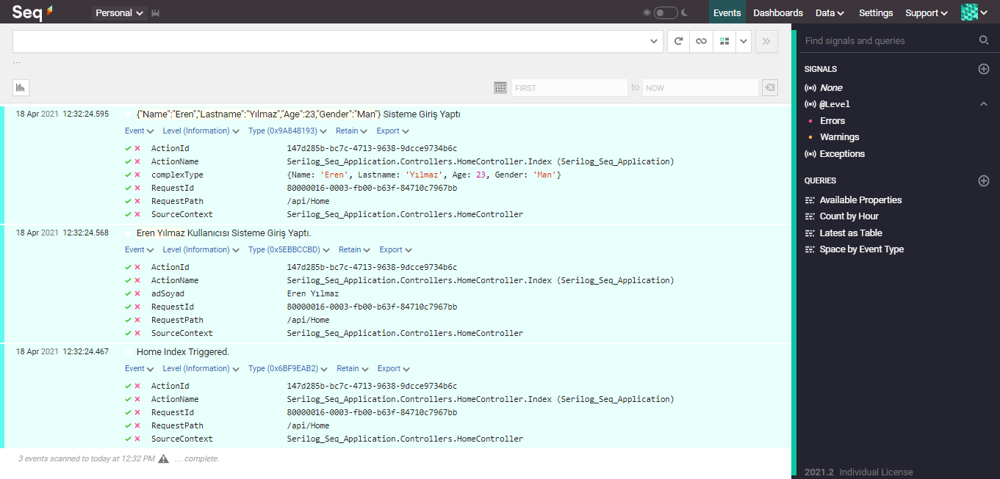
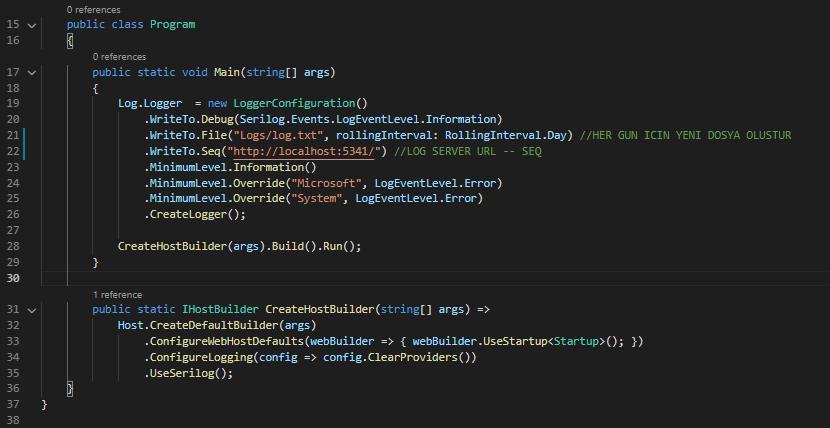
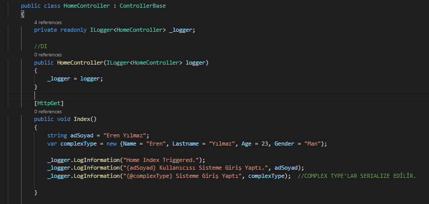

# .Net Core - Serilog Konfigürasyonu ve Seq Üzerinde Görselleştirilmesi




## Proje Açıklaması

Bu Projede .Net Core Platformu Üzerinde Serilog Kütüphanesinin konfigürasyonunu, kullanımını ve oluşturulan logların Seq üzerinde görselleştirilmesini gerçekleştirdik.

Öncelikle, Seq'in kurulumunu [şuradan](https://datalust.co/download) yapabilirsiniz. Windows için kurulumu yapabilir, ayrıca docker içinde de ayağa kaldırabilirsiniz.


.Net Core Web API projemizi oluşturdukdan sonra, ilgili paketleri projemize dahil etmemiz gerekmektedir.


```
Serilog.AspNetCore
Serilog.Sinks.File   --> Dosyaya Loglama İçin
Serilog.Sinks.Debug  --> Debug Ortamına Loglama İçin
Serilog.Sinks.Seq    --> Seq'e Loglama İçin
```

Paketleri kurduktan sonra, Program.cs dosyası içerisinde serilog konfigürasyonumuzu yapabiliriz.



Artık loglamaya geçerek testimizi yapalım.



Index methotu her tetiklendiğinde, içerisinde belirtilen loglar belirttiğimiz log dosyasına, debug penceresine ve seqe kaydedilir. seq urlmiz olan http://localhost:5341 adresine gidersek, loglarımızın çıktısını görebiliriz.

